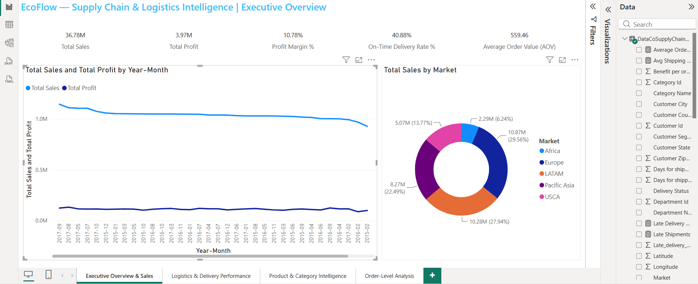
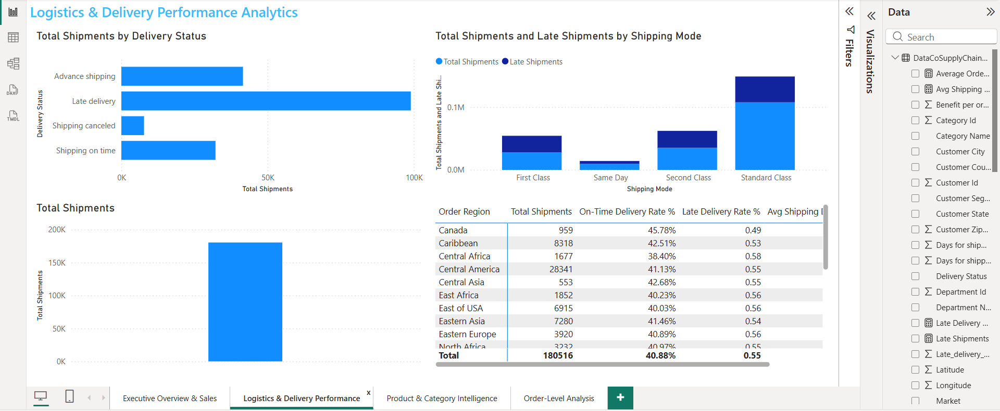
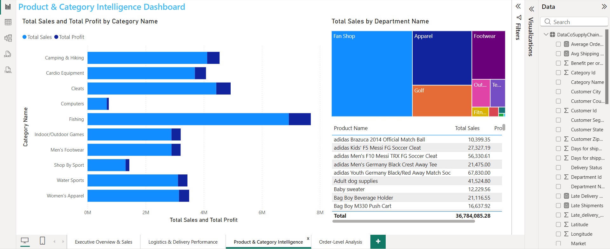
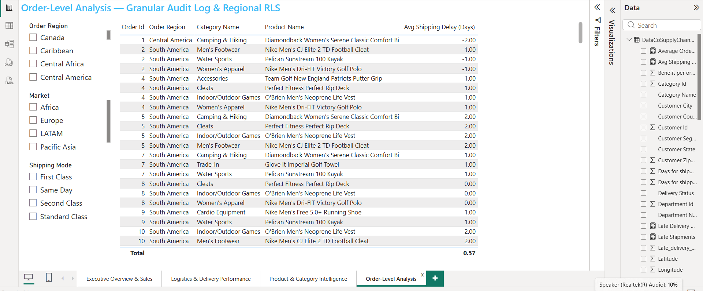

# ⚡ EcoFlow — Supply Chain & Logistics Intelligence Dashboard

<p align="center">
  
  
  
  
</p>

<p align="center">
  <strong>Global Sales • Profitability • Logistics • Delivery Performance • Product Intelligence</strong>
</p>

<p align="center">
  An interactive Power BI Business Intelligence dashboard that transforms raw supply chain data into meaningful business insights.
</p>

---

## 📌 Project Overview

**EcoFlow — Supply Chain & Logistics Intelligence Dashboard** is a portfolio-ready **Business Intelligence project developed entirely using Microsoft Power BI Desktop**.

The project analyzes **180,519 supply chain records across 53 columns** and transforms raw operational data into an interactive dashboard covering sales, profitability, logistics, delivery performance, products, categories, markets, regions, and orders.

The dashboard helps answer important business questions such as:

- 💰 How much revenue and profit is being generated?
- 📈 How is business performance changing over time?
- 🚚 How reliable is the delivery process?
- ⚠️ How significant are late deliveries?
- 🌍 Which markets and regions contribute to sales?
- 📦 Which products and categories perform best?
- 🚛 How do shipping modes compare?
- 🛒 What is happening at the individual order level?

---

# 🖥️ Dashboard Preview

The project contains **4 interactive Power BI dashboard pages**.

### 🏠 Executive Overview & Sales



### 🚚 Logistics & Delivery Performance



### 📦 Product & Category Intelligence



### 🛒 Order-Level Analysis



---

# 🎯 Business Problem

Supply chain organizations generate large amounts of operational data, but raw data alone makes it difficult to identify performance issues and business opportunities.

EcoFlow converts this raw data into an interactive analytical solution that helps users understand:

- Sales performance
- Profitability
- Delivery reliability
- Shipping delays
- Regional performance
- Product performance
- Category contribution
- Order-level operations

The goal is to provide a centralized dashboard for **business performance monitoring and operational decision-making**.

---

# 📊 Dataset

The project uses a supply chain dataset containing:

| Attribute | Details |
|---|---:|
| 📌 Records | **180,519** |
| 📌 Columns | **53** |
| 📌 Data Type | Supply Chain / E-Commerce |
| 📌 Source Format | CSV |
| 📌 BI Tool | Power BI Desktop |

The dataset includes information related to:

- Orders
- Customers
- Products
- Categories
- Departments
- Markets
- Regions
- Sales
- Profit
- Shipping
- Delivery status
- Order dates
- Shipping dates
- Customer information

---

# 🛠️ Technology Stack

| Technology | Purpose |
|---|---|
| **Microsoft Power BI Desktop** | Dashboard development and visualization |
| **Power Query** | Data cleaning and transformation |
| **DAX** | Measures and analytical calculations |
| **CSV** | Source dataset |
| **Markdown** | Project documentation |

---

# 📈 Executive KPI Snapshot

The following metrics were calculated from the raw dataset:

| KPI | Value |
|---|---:|
| 💰 **Total Sales** | **$36.78M** |
| 📈 **Total Profit** | **$3.97M** |
| 📊 **Profit Margin** | **10.78%** |
| 🛒 **Unique Orders** | **65,752** |
| 💵 **Average Order Value** | **$559.45** |
| 🚚 **On-Time Delivery Rate** | **40.88%** |
| ⚠️ **Late Delivery Rate** | **54.83%** |
| ❌ **Shipping Canceled** | **4.30%** |

---

# 🚚 Delivery Performance

Delivery performance is one of the major analytical areas of this project.

| Delivery Status | Shipments | Percentage |
|---|---:|---:|
| 🔴 Late delivery | **98,977** | **54.83%** |
| 🟢 Advance shipping | **41,592** | **23.04%** |
| 🟡 Shipping on time | **32,196** | **17.84%** |
| ⚫ Shipping canceled | **7,754** | **4.30%** |
| **Total** | **180,519** | **100%** |

### 📌 On-Time Delivery Definition

For this project:

**On-Time Delivery = Advance Shipping + Shipping on Time**

```text
(41,592 + 32,196) / 180,519
= 40.88%